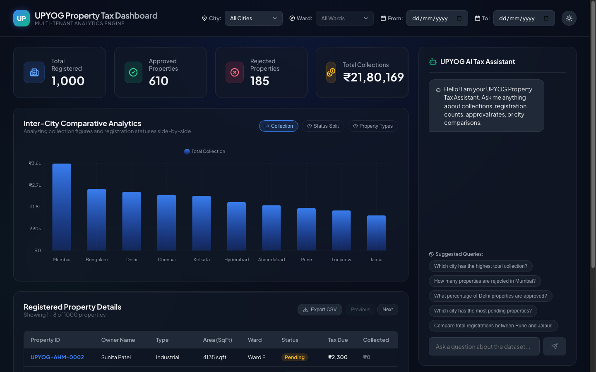
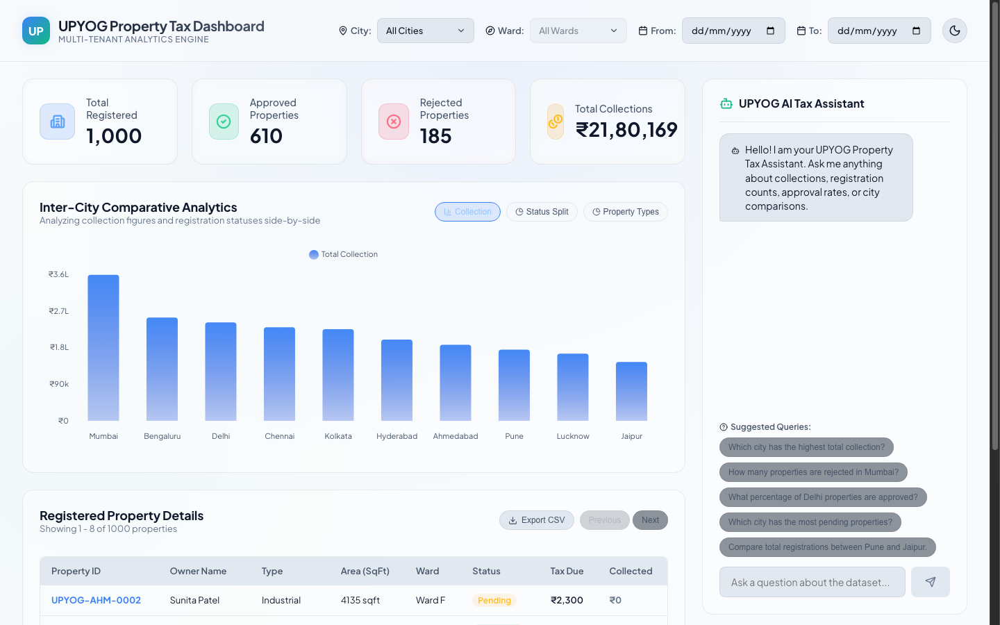
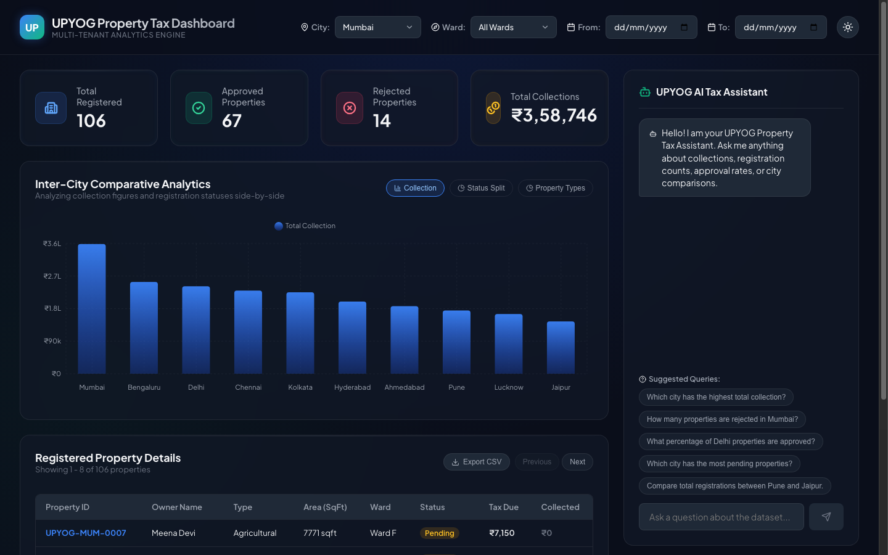
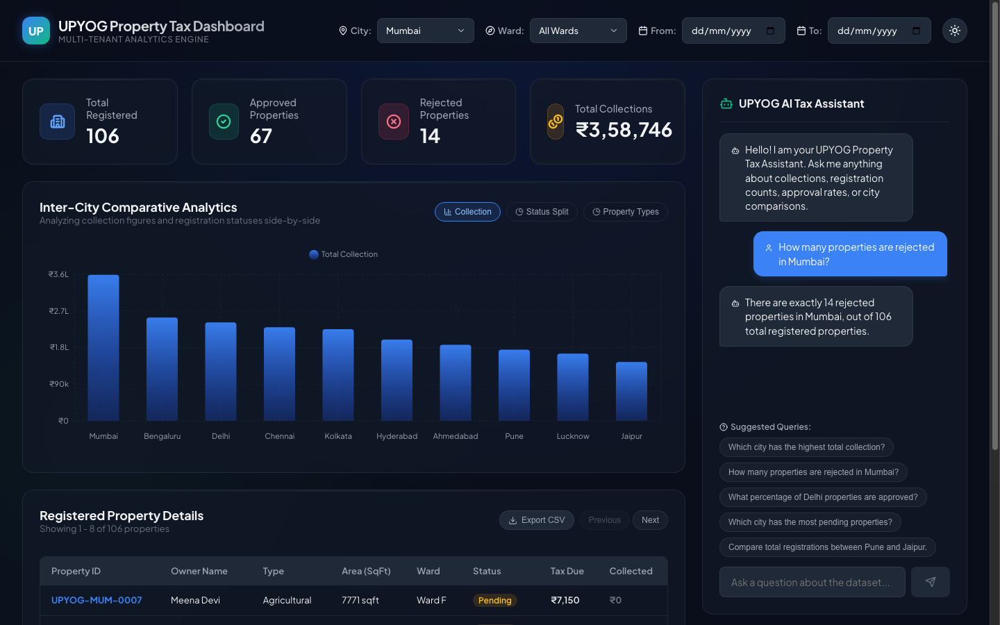

# UPYOG Property Tax Analytics Dashboard

> A modern React dashboard for analyzing property tax data across 10 Indian cities with AI-powered chat insights.

## 📸 Dashboard Previews

### 1. Dark Mode Analytics (Default)


### 2. Light Mode Analytics (Theme Toggle)


### 3. Multi-Tenant Filters (Mumbai Selected)


### 4. Interactive AI Tax Assistant


## 🎯 Problem Statement

Build a multi-tenant property tax analytics dashboard for the UPYOG platform that serves 10 Indian cities. The dashboard must display key metrics, provide comparative analysis across cities, and enable natural language queries about property data through an AI assistant.

## ✨ Features

- **KPI Dashboard** — Real-time metrics (Total Properties, Approved Count, Rejected Count, Total Collection)
- **City Tenant Filter** — Switch between 10 cities or view all data aggregated
- **Comparison Charts** — Bar charts, pie charts, and grouped comparisons across cities
- **AI Chat Assistant** — Natural language queries answered by Claude/Gemini API
- **Responsive Design** — Works seamlessly on desktop and mobile

## 🛠 Tech Stack

- **Frontend**: React 19 with Vite
- **Backend (Optional Database Backend)**: Node.js / Express server proxying chat requests and managing REST API endpoints
- **Database**: PostgreSQL with connection pooling (`pg`), table auto-creation, and self-seeding (1,000 properties loaded automatically on startup)
- **Styling**: Vanilla CSS (customized premium glassmorphic UI with Light & Dark mode support)
- **Charts**: Recharts (interactive Bar & Pie charts)
- **AI API**: Gemini API (proxied securely via the backend server, incorporating dynamic database context)

## 📊 Dataset Overview

- **Records**: 1,000 properties
- **Cities**: Delhi, Mumbai, Pune, Bengaluru, Chennai, Hyderabad, Ahmedabad, Kolkata, Jaipur, Lucknow
- **Fields**: property_id, tenant, owner_name, property_type, ward, area_sqft, status, annual_tax_inr, collection_inr, registration_date, floor_count, address
- **Statuses**: Approved, Rejected, Pending

## 🚀 Quick Start

### Prerequisites

- Node.js 18+ and npm
- PostgreSQL running locally (defaulting to standard ports and credentials)
- Gemini API Key

### Installation

```bash
# Clone the repository
git clone https://github.com/YOUR_USERNAME/upyog-property-dashboard.git
cd upyog-property-dashboard

# Install frontend dependencies
npm install

# Install backend dependencies
cd server && npm install && cd ..

# Create .env.local file in the root directory
touch .env.local

# Add your Gemini API key (never commit this!)
echo "VITE_GEMINI_API_KEY=your_key_here" >> .env.local
```

### Running Locally

To run the Vite frontend and Express server concurrently (which auto-creates/seeds the PostgreSQL database):

```bash
npm run dev:all

# Open client at http://localhost:5173
# Backend runs at http://localhost:5001
```

### Build for Production

```bash
npm run build
npm run preview
```

## 📁 Project Structure

```
upyog-property-dashboard/
├── server/
│   ├── package.json
│   └── server.js
├── src/
│   ├── components/
│   │   ├── KpiCard.jsx
│   │   ├── TenantFilter.jsx
│   │   ├── ComparisonChart.jsx
│   │   ├── ChatAssistant.jsx
│   │   └── Dashboard.jsx
│   ├── hooks/
│   │   └── usePropertyData.js
│   ├── utils/
│   │   ├── formatters.js
│   │   ├── aiClient.js
│   │   └── constants.js
│   ├── data/
│   │   └── properties.json
│   ├── App.jsx
│   └── index.css
├── public/
├── API_CONTRACTS.md
├── ARCHITECTURE.md
├── BUGS.md
├── DECISIONS.md
├── EXPERIMENTS.md
├── LEARNINGS.md
├── PROJECT_CONTEXT.md
├── PROMPTS.md
├── STYLE_GUIDE.md
├── TASKS.md
├── .env.local (ignored)
├── .gitignore
├── package.json
├── vite.config.js
└── README.md
```

## 🎯 Scoring Breakdown (100 points)

| Component | Points | Status |
|-----------|--------|--------|
| KPI Dashboard (4 cards) | 30 | ✅ Done |
| Tenant Filter | 15 | ✅ Done |
| Comparison Chart | 10 | ✅ Done |
| AI Chat Assistant | 25 | ✅ Done |
| Code Quality & Structure | 10 | ✅ Done |
| README & Setup | 10 | ✅ Done |
| **Total** | **100** | |

### Shortlisting Criteria

- **70+**: Shortlisted for interview
- **55-69**: Manual review
- **<55**: Not shortlisted

## 🤖 AI Assistant Examples

The chat should answer questions like:

- "Which city has the highest total collection?"
- "How many properties are rejected in Mumbai?"
- "What percentage of Delhi properties are approved?"
- "Which city has the most pending properties?"
- "Compare total registrations between Pune and Jaipur."

## 🔐 Security Notes

- **Never commit API keys** — use `.env.local` with `.gitignore`
- Store sensitive keys in environment variables
- Validate all user inputs before sending to API
- Consider rate limiting for chat requests

## 📝 Important Dates

- **Assessment Duration**: 48 hours
- **Submission**: GitHub repo + screenshots to HR email
- **Shortlist Announcement**: [Insert date]

## 💡 Tips for Success

1. Start with KPI dashboard (highest points)
2. Get the tenant filter working early — it affects multiple components
3. Use sample data queries first, then integrate real data
4. Test AI responses with edge cases
5. Write clean, commented code
6. Update PROJECT_CONTEXT.md daily

## 🐛 Troubleshooting

See `BUGS.md` for common issues and solutions.

## 📚 Additional Resources

- [React Documentation](https://react.dev)
- [Recharts Gallery](https://recharts.org/examples)
- [Tailwind CSS Docs](https://tailwindcss.com)
- [Gemini API Guide](https://ai.google.dev)

## ✅ Checklist Before Submission

- [x] All 4 KPIs display correctly
- [x] Tenant filter updates all components
- [x] Chart renders with multiple cities
- [x] AI chat responds to at least 5 sample questions
- [x] Code is well-structured and commented
- [x] properties.json is in repo
- [x] .env file is in .gitignore
- [x] README has complete setup instructions
- [x] Screenshots taken and ready
- [x] GitHub repo is public

## 📧 Questions?

Check `docs/PROJECT_CONTEXT.md` first, then refer to the assessment PDF for contact details.

---

**Last Updated**: 2026-05-21  
**Status**: Completed 🟢
